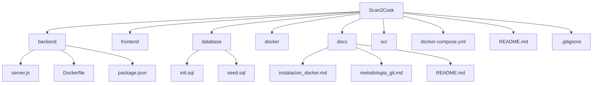

# 🥫 Scan2Cook – Tu despensa inteligente

**Proyecto PTI – Curso 2025**  
Gestor de inventario doméstico con OCR, recetas y asistente de voz.

---

## 🚀 Descripción general

Scan2Cook es una aplicación que permite registrar los productos que el usuario tiene en su despensa o nevera, **leer tickets de compra con OCR** y **recomendar recetas** basadas en los ingredientes disponibles.  
El sistema está compuesto por varios módulos conectados mediante una arquitectura **cliente-servidor**, con componentes Dockerizados para facilitar el despliegue y el trabajo en equipo.

---

## 👥 Equipo

| Rol | Nombre |
|-----|--------|
| Backend (API REST) | Irene |
| Base de datos (PostgreSQL, modelo de datos) | Roger |
| OCR (Tesseract / Vision API) | Zineb |
| Integración API recetas (Spoonacular) | Salma |
| Frontend (React – login, inventario, recetas) | Glaira |
| IA Recetas / Algoritmo recomendación | Roger |
| Integración voz (Alexa / Google Assistant) | Zineb |
| Gamificación y módulo social | Irene |


---

## 🧩 Tecnologías principales

- **Frontend:** React  
- **Backend:** Node.js + Express  
- **Base de datos:** PostgreSQL  
- **OCR:** Tesseract.js / Google Vision API  
- **Recetas:** API externa (Spoonacular)  
- **Contenedores:** Docker y Docker Compose  
- **Autenticación:** JWT  
- **Seguridad:** HTTPS  

---

## 🛠️ Requisitos previos

Antes de empezar, asegúraos de tener instalado en vuestro equipo:

- [Git](https://git-scm.com/downloads)
- [Node.js 20+](https://nodejs.org/)
- [Docker Desktop](docs/instalacion-docker-windows.md)
- Visual Studio Code (recomendado)

---

## 📦 Instrucciones de instalación

### 1️⃣ Clonar el repositorio
Abre tu terminal o Visual Studio Code y ejecuta:

```bash
# 1. Crear una carpeta para tus proyectos (solo la primera vez)
mkdir ~/Proyecto
cd ~/Proyecto

# 2. Clonar el repositorio
git clone https://github.com/RogerCL24/scan2cook.git

# 3. Entrar en la carpeta del proyecto
cd pti-scan2cook
```

### 2️⃣ Estructura del proyecto



### 3️⃣ Cómo trabajar (guía)
1. Lee la guía dentro de /docs/ -> [metodologia_git.md](docs/metodologia_git.md)

### 📚 Créditos
Proyecto desarrollado por el grupo Scan2Cook – PTI 2025.
[Universitat Politecnica de Catalunya](https://github.com/UPC), Departament de Tecnologies de la Informació.