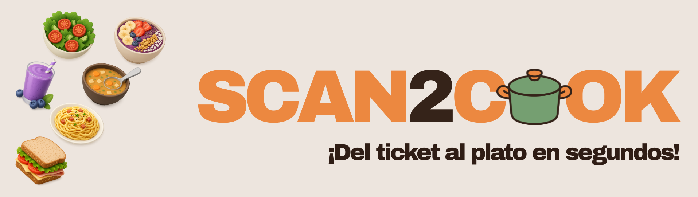
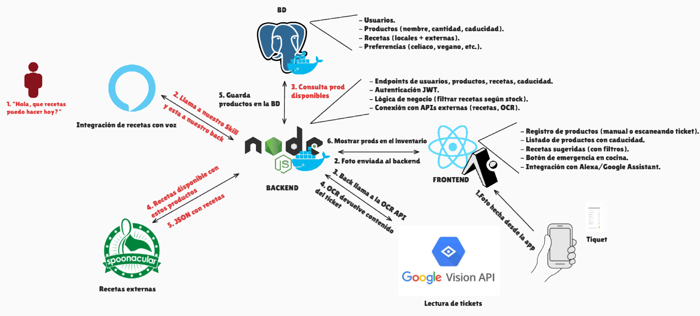
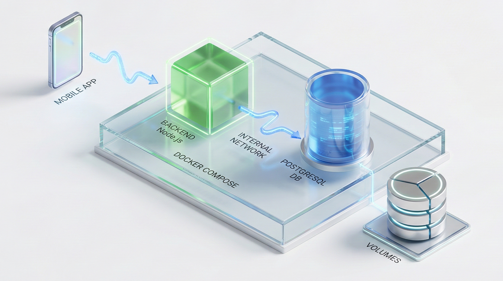
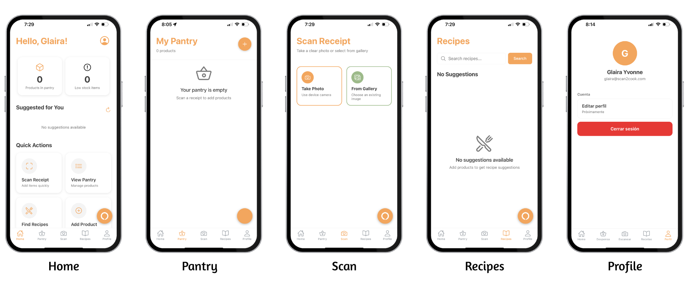

# Scan2Cook — Resumen del Proyecto PTI 2025

## Introducción
Scan2Cook es una aplicación que gestiona la despensa doméstica y extrae información de tickets de compra mediante OCR para recomendar recetas según los ingredientes disponibles. Este resumen refleja el estado actual, los hitos logrados y el plan para completar el MVP.

---

## Objetivos del MVP
- Registrar y consultar productos del inventario.
- Leer tickets con OCR, limpiar y parsear líneas de producto.
- Recomendar recetas basadas en ingredientes disponibles (integración externa básica).
- Autenticación y control de acceso (JWT) y app móvil con Expo Go.
- Consulta por voz con Alexa (skill integrada).
- Despliegue reproducible del backend y BBDD mediante contenedores.

---

## Funcionalidades clave
- Inventario: alta, consulta y gestión de productos.
- OCR de tickets: extracción con Google Vision; parseo estructurado por Regex (baseline) o LLM (Vertex AI/Gemini).
- Recetas: integración con API externa (en progreso) y recomendador.
- Autenticación: login/registro con token.
- App móvil (Expo Go): flujo Scan → Review → Inventario → Recetas.
- Voz (Alexa): consulta y acciones sobre el inventario y recetas.

---

## Estado del proyecto
- Hecho: Backend con endpoints (auth, ocr, products), pipeline OCR (limpieza y parser), Alexa skill funcional, despliegue backend+DB con Docker Compose.
- En progreso: integración de API de recetas y recomendador en la app móvil.
- Pendiente: módulos sociales/gamificación.
- Desviaciones: claves externas (APIs) y tuning de rendimiento OCR/latencia de voz.

---

## Arquitectura

- App móvil (React Native + Expo Go) consume el backend vía HTTP.
- Backend Express expone APIs y conecta con la base de datos.
- Base de datos PostgreSQL para persistencia de usuarios, productos y recetas.
- OCR externo (Google Vision) como servicio de extracción; pipeline de limpieza y parseo.
- Parseo de ticket: Regex como baseline; LLM (Vertex AI/Gemini) opcional según disponibilidad de clave.
- Alexa Skill: peticiones HTTPS (AVS) hacia el backend; respuesta por voz.
- API de recetas externa (Spoonacular) para sugerencias.

---

## Despliegue

- Orquestación con Docker Compose para backend y base de datos (red interna, volúmenes).
- App móvil con Expo Go (no dockerizada): ejecución vía LAN o túnel seguro.
- Alexa: integración mediante endpoint público (por ejemplo `ngrok`) hacia el backend.
- Configuración: variables de entorno (URL BBDD, JWT, claves externas de OCR/recetas/AVS).
- Operación: levantar servicios del backend con compose; lanzar la app móvil con Expo.

---

## Flujo de uso

- Scan: captura/subida de imagen del ticket desde móvil.
- OCR: extracción del texto bruto (externo: Google Vision).
- Limpieza: normaliza el texto y elimina ruido.
- Parseo: identifica líneas de producto y estructura campos (Regex o LLM).
- Inventario: guarda/actualiza productos y cantidades.
- Recetas: sugiere recetas compatibles con los ingredientes disponibles.

---

## Módulos y responsabilidades
| Módulo | Responsable |
|-------|-------------|
| Backend (API REST) | Irene |
| Base de datos (PostgreSQL, modelo de datos) | Roger |
| OCR y parseo (Google Vision; Regex/Gemini) | Zineb |
| Integración API recetas (Spoonacular) | Salma |
| App móvil (React Native + Expo Go) | Glaira |
| IA Recetas / Algoritmo recomendación | Roger |
| Voz (Alexa Skill) | Zineb |
| Gamificación y módulo social | Irene |

---

## Capturas principales
- App móvil: 
---

## Resultados y métricas
- APIs operativas: autenticación, OCR, productos; Alexa intents funcionales.
- Flujo móvil funcional: subida de ticket, extracción, limpieza y parseo.
- Indicadores: tasa de extracción útil, tiempo medio por ticket y latencia de respuesta por voz.
- Rendimiento/UX: compresión de imágenes en móvil; estabilidad de túnel público para Alexa.

---

## Riesgos y mitigaciones
- Claves externas (OCR/recetas/AVS): gestión segura y disponibilidad del servicio.
- Calidad OCR en tickets reales: mejora de limpieza y reglas de parseo.
- Conectividad móvil y túnel público: uso de `ngrok`/expo-tunnel y monitorización.
- Dependencia de LLM (Vertex AI/Gemini): usar parser Regex como alternativa sin dependencia externa.
- Plazos: priorización del MVP y pruebas automatizadas de flujos clave.

---

## Roadmap
- Corto plazo: integrar API de recetas en móvil, pulir UX de revisión, endurecer validaciones.
- Medio plazo: recomendador inicial, métricas de extracción y caching de resultados.
- Fase siguiente: social/gamificación y pruebas E2E.

---

## Conclusiones
El proyecto ha alcanzado un estado funcional en los pilares del MVP (backend, OCR, voz con Alexa y despliegue). La app móvil con Expo Go sustituye al frontend web. Queda por completar la integración de recetas y módulos sociales para cerrar la propuesta de valor.

---

## Créditos
- Equipo Scan2Cook – PTI 2025, Universitat Politècnica de Catalunya (UPC).
