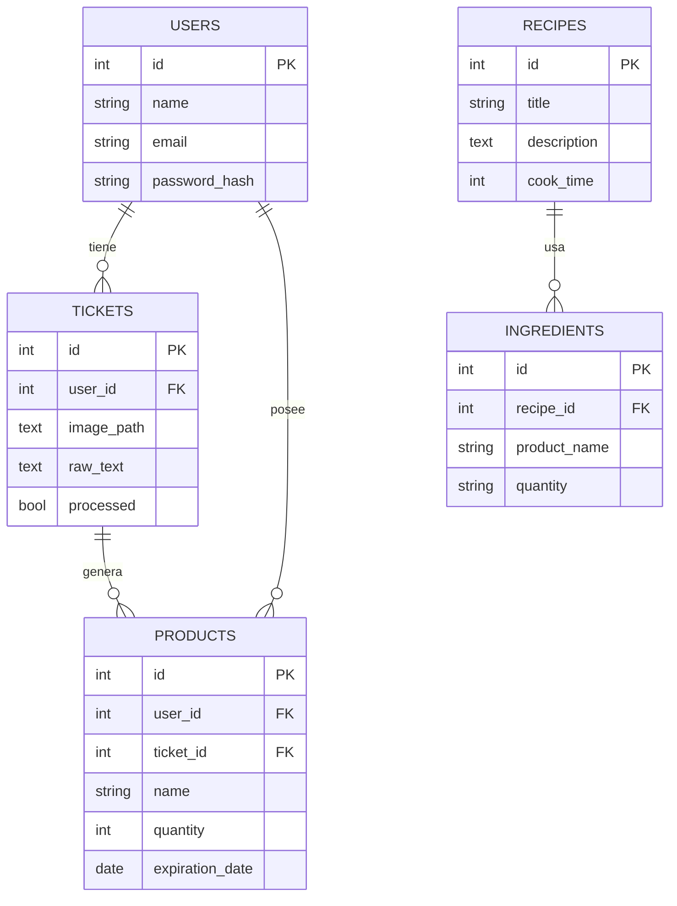

# Base de Datos – Scan2Cook

Este módulo contiene los scripts SQL necesarios para crear y poblar la base de datos del proyecto Scan2Cook.
El objetivo es gestionar la información de usuarios, productos en la despensa y recetas disponibles.

## 📁 Archivos principales
| Archivo | Descripción |
| -------- | ---------- |
| ``init.sql`` | Crea las tablas principales: usuarios, productos, recetas, ingredientes y tickets. |
| ``seed.sql`` | Inserta datos iniciales de prueba para poder testear el backend. |

## Concepto general
El sistema parte de un modelo simple:
- **Usuarios** (users) → cada persona con su despensa.

- **Productos** (products) → los alimentos que el usuario tiene registrados.

- **Recetas** (recipes) → propuestas de platos que puede cocinar.

- **Ingredientes** (ingredients) → qué productos necesita cada receta.

- **Tickets** (tickets) → tickets subidos por usuarios.

Las relaciones se definen con claves foráneas y borrado en cascada para mantener la integridad referencial.

## Diagrama entidad–relación (ER)

## Autor
