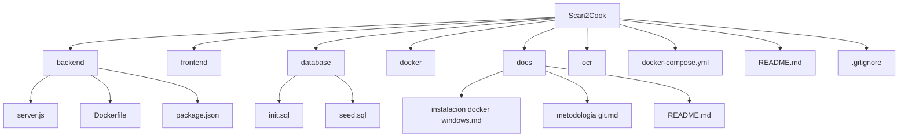

# Estructura actual del proyecto

```mermaid
graph TD
  A[Scan2Cook] --> B[backend]
  A --> C[frontend]
  A --> D[database]
  A --> E[docker]
  A --> F[docs]
  A --> G[ocr]
  
  B --> B1[server.js]
  B --> B2[Dockerfile]
  B --> B3[package.json]
  
  D --> D1[init.sql]
  D --> D2[seed.sql]
  
  F --> F1[instalacion docker windows.md]
  F --> F2[metodologia git.md]
  F --> F3[README.md]
  
  A --> H[docker-compose.yml]
  A --> I[README.md]
  A --> J[.gitignore]
```